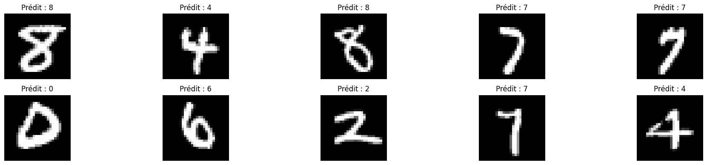
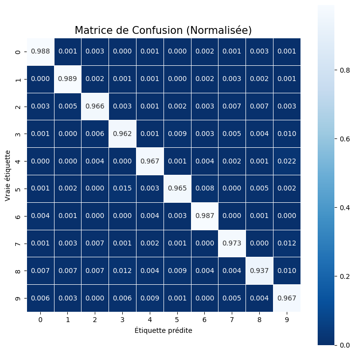

# Classification of handwritten numbers (MNIST) with a multilayer perceptron neural network (MLP)
## Phase 1 : Fruit classification with a decision tree
### 1. et 2.
De base, le script **_1_classification_fruits.py_** comporte une erreur.
> ValueError: could not convert string to float: 'Rouge'

Cela vient du fait que Scikit-learn ne peut pas traiter des chaînes de caractères comme "Rouge" ou "Ronde".\
Il faut convertir ces valeurs en nombres avant d'entraîner le modèle, grâce aux bibliothèques suivantes :
```python
from sklearn.preprocessing import OneHotEncoder
from sklearn.compose import ColumnTransformer
```
On applique OneHotEncoder aux deux colonnes (couleur et forme).

```python
encoder = ColumnTransformer(
    transformers=[('encoder', OneHotEncoder(), [0, 1])], # Appliquer OneHotEncoder aux colonnes 0 et 1 (couleur et forme)
    remainder='passthrough'  # Laisser les autres colonnes inchangées (s'il y en avait)
)
```

&nbsp;  

Voici donc le script fonctionnel :
```python
from sklearn.tree import DecisionTreeClassifier
from sklearn.preprocessing import OneHotEncoder
from sklearn.compose import ColumnTransformer

attributs = [
    ["Rouge", "Ronde"],
    ["Jaune", "Allongée"],
    ["Orange", "Ronde"],
    ["Vert", "Ronde"],
    ["Jaune", "Ronde"]
]
etiquettes = ["Pomme", "Banane", "Orange", "Pomme", "Banane"]

encoder = ColumnTransformer(
    transformers=[('encoder', OneHotEncoder(), [0, 1])],
    remainder='passthrough'
)

# Encoder les attributs
attributs_encoded = encoder.fit_transform(attributs)

# Créer un modèle d'arbre de décision (un modèle simple de classification)
modele = DecisionTreeClassifier()

# Apprendre au modèle à partir des données (l'entraîner)
modele.fit(attributs_encoded, etiquettes)

# Faire des prédictions pour de nouveaux fruits
nouveaux_fruits = [
    ["Rouge", "Ronde"],
    ["Jaune", "Allongée"],
    ["Vert", "Ronde"]
]

# Encoder les nouveaux fruits avant de faire des prédictions
nouveaux_fruits_encoded = encoder.transform(nouveaux_fruits)
predictions = modele.predict(nouveaux_fruits_encoded)

print("Prédictions pour les nouveaux fruits :")
for i in range(len(nouveaux_fruits)):
    print(f"Un fruit {nouveaux_fruits[i][0]} et {nouveaux_fruits[i][1]} est prédit comme étant un(e) : {predictions[i]}")

```
Grâce à ce code, on obtient :
> Prédictions pour les nouveaux fruits :  
> Un fruit Rouge et Ronde est prédit comme étant un(e) : Pomme  
> Un fruit Jaune et Allongée est prédit comme étant un(e) : Banane  
> Un fruit Vert et Ronde est prédit comme étant un(e) : Pomme

&nbsp;  
### 3. Modification des données
En modifiant les caractéristiques des nouveaux_fruits
```python
nouveaux_fruits = [
    ["Rouge", "Ronde"],
    ["Jaune", "Allongée"],
    ["Vert", "Ronde"],
    ["Orange", "Ronde"],
    ["Vert", "Allongée"],
    ["Orange", "Allongée"]
]
```
On obtient
> Prédictions pour les nouveaux fruits :  
> Un fruit Rouge et Ronde est prédit comme étant un(e) : Pomme  
> Un fruit Jaune et Allongée est prédit comme étant un(e) : Banane  
> Un fruit Vert et Ronde est prédit comme étant un(e) : Pomme  
> Un fruit Orange et Ronde est prédit comme étant un(e) : Orange  
> Un fruit Vert et Allongée est prédit comme étant un(e) : Pomme  
> Un fruit Orange et Allongée est prédit comme étant un(e) : Orange

&nbsp;   
En ajoutant des attributs et etiquettes
```python
attributs = [
    ...
    ["Bleu", "Ronde"],
    ["Marron", "Allongée"]
]
etiquettes = [..., "Myrtille", "Date"]
```
Puis en rajoutant de nouveaux fruits :
```python
nouveaux_fruits = [
    ...
    ["Bleu", "Ronde"],
    ["Marron", "Allongée"]
]
```
On obtient
>  Prédictions pour les nouveaux fruits :  
>  Un fruit Rouge et Ronde est prédit comme étant un(e) : Pomme  
>  Un fruit Jaune et Allongée est prédit comme étant un(e) : Banane  
>  Un fruit Vert et Ronde est prédit comme étant un(e) : Pomme  
>  Un fruit Orange et Ronde est prédit comme étant un(e) : Orange  
>  Un fruit Vert et Allongée est prédit comme étant un(e) : Date  
>  Un fruit Orange et Allongée est prédit comme étant un(e) : Date  
>  Un fruit Bleu et Ronde est prédit comme étant un(e) : Myrtille  
>  Un fruit Marron et Allongée est prédit comme étant un(e) : Date  

&nbsp; 
### 4. Résumé

Ce code entraîne un modèle d'arbre de décision pour classifier des fruits en fonction de leur couleur et forme.\
On lui donne des _attributs_ (par exemple *Jaune*, *Allongée*), auquels on associé une _étiquette_ (exemple : *Banane*).\
Comme les arbres de décision ne peuvent pas traiter du texte, le code va convertir ce texte en variables binaires (0 et 1).\
\
Une fois le modèle entraîné avec les données existantes, il est utilisé pour prédire le type de fruit en fonction de nouvelles entrées, ici _nouveaux_fruits_

* Un fruit Rouge et Ronde est classé comme une Pomme.
* Un fruit Jaune et Allongée est classé comme une Banane.
* Un fruit Orange et Ronde est classé comme une Orange.

Le modèle réussit ainsi à généraliser la classification des fruits sur la base des caractéristiques fournies.\
\
On peut imaginer combiner ce code avec une IA qui analyserait une photo, afin de détécter quels sont les fruits présents sur la photo.  
&nbsp;  
&nbsp;  
&nbsp;  

## Phase 2 : Building a MLP model on MNIST - preliminary steps
### 1. Executing the script
Now, we run **_2_construire_mlp_mnist.py_** \
\
Once the script is executed, the output is :
>  Forme des données d'images (X) : (70000, 784)  
>  Forme des étiquettes (y) : (70000,)  
>  Modèle MLP simple créé : MLPClassifier(hidden_layer_sizes=(50,), max_iter=10)  
>  Modèle MLP à deux couches créé : MLPClassifier(hidden_layer_sizes=(100, 50), max_iter=10)  
>  MLP avec optimiseur Adam : MLPClassifier(hidden_layer_sizes=(50,), max_iter=10)  
>  MLP avec optimiseur SGD : MLPClassifier(hidden_layer_sizes=(50,), learning_rate_init=0.01, max_iter=10, solver='sgd')  

&nbsp; 
### 2. Checking MNIST datas
The **MNIST database** is a large database of handwritten digits, which contains 60,000 training images and 10,000 testing images (each is a 28x28 pixel bounding box and anti-aliased, with grayscale levels). \
It is commonly used for training various image processing systems (and so in the field of machine learning). \
&nbsp;  
First, we import libraries then load the **MNIST database**.
```python
from sklearn.datasets import fetch_openml
from sklearn.neural_network import MLPClassifier
import numpy as np

mnist = fetch_openml('mnist_784', version=1)
X = mnist.data
y = mnist.target
```

We print data and label shapes
```python
print("Forme des données d'images (X) :", X.shape)
print("Forme des étiquettes (y) :", y.shape)
```
_X.shape → (70000, 784)_ : 70 000 images of 784 pixels (28x28). \
_y.shape → (70000,)_ : 70 000 labels, one for each image.

&nbsp; 

Then, data is being prepared
```python
X = X / 255.0
```
Scaling: Pixels have values between 0 and 255 (grayscale). \
We divide it by 255 to normalize between 0 and 1. \
Why? Better standardization accelerates learning and improves accuracy.

&nbsp; 

Then we build a first MLP (1 single hidden layer of 50 neurons)
```python
mlp_simple = MLPClassifier(hidden_layer_sizes=(50,), max_iter=10)
print("Modèle MLP simple créé :", mlp_simple)
```
And a second MLP (2 hidden layers, the first with 100 neurons and the second one with 50 neurons).
```python
mlp_deux_couches = MLPClassifier(hidden_layer_sizes=(100, 50), max_iter=10)
print("Modèle MLP à deux couches créé :", mlp_deux_couches)
```

&nbsp; 

Finally, we try 2 different optimization algorithms.  \
With Adam
```python
mlp_adam = MLPClassifier(hidden_layer_sizes=(50,), solver='adam', max_iter=10)
print("MLP avec optimiseur Adam :", mlp_adam)
```

With SGD
```python
mlp_sgd = MLPClassifier(hidden_layer_sizes=(50,), solver='sgd', learning_rate_init=0.01, max_iter=10)
print("MLP avec optimiseur SGD :", mlp_sgd)
```

&nbsp; 

#### The script does not perform a full training. It focuses on creating and configuring different MLP models. *_max_iter=10_* is too low to perform a good learning.

&nbsp; 

### 3. Steps required to build an MLP model with scikit-learn and hyperparameters
Building an MLP with Scikit-Learn requires :
- Load and prepare the data.
- Divide into train/test.
- Create a MLP model (MLPClassifier).
- Train (.fit())
- Evaluate (.score())

Key hyperparameters :
- *_hidden_layer_sizes_* → Number of neurons/layers.
- *_max_iter_* → Number of learning iterations.
- *_solver_* → Optimization algorithm.
- *_learning_rate_init_* → Learning rate.
- *_activation_* → Function of activation of neurons.

&nbsp; 

## Phase 3 : Training and evaluation of a MLP model on MNIST
### 1. Code execution
Now, we run **_3_entrainer_evaluer_mlp_mnist.py_** \
\
Once the script is executed, the output is :

>  MLP Model created : MLPClassifier(hidden_layer_sizes=(50,), max_iter=10, random_state=42)  
>  Model accuracy on test set : 96.45%  
>  Some predictions and actual labels :  
>  Image 1: Prediction = 8, Real = 8  
>  Image 2: Prediction = 4, Real = 4  
>  Image 3: Prediction = 8, Real = 8  
>  Image 4: Prediction = 7, Real = 7  
>  Image 5: Prediction = 7, Real = 7  
>  Image 6: Prediction = 0, Real = 0  
>  Image 7: Prediction = 6, Real = 6  
>  Image 8: Prediction = 2, Real = 2  
>  Image 9: Prediction = 7, Real = 7  
>  Image 10: Prediction = 4, Real = 4  

&nbsp;  

### 2. Outputs analysis

The training take around 25-30 seconds to complete.  \
The model accuracy indicates the percentage of images correctly classified by the MLPClassifier. Here it's **96.45 %**.

To improve the accuracy, we can : 
- Increase *_max_iter_* to allow better learning.
- Add more neurons (*_hidden_layer_sizes_*) to capture more patterns.
- Try another algorithm (solver='adam' or 'sgd') to optimize learning.
#### We are going to try this in the next step.
&nbsp;  
This MLP model didn't make mistakes on the 10 example he gave us at he end of the script.
Let's try to see with 100 examples :
```python
mlp = MLPClassifier(hidden_layer_sizes=(50,), max_iter=20, random_state=42)
```
>  Image 14: Prediction = 1, Real = 2

So the examples are really a good representation of the accuracy percentage, because on my 100 examples, only 96 were right.

&nbsp;  


### 3. Impact of inputs on different outputs
- *_max_iter_* (= 10 by default)
```python
mlp = MLPClassifier(hidden_layer_sizes=(50,), max_iter=20, random_state=42)
```
↳ Execution time : approx. 45 seconds
>  Model accuracy on test set : 96.89%
```python
mlp = MLPClassifier(hidden_layer_sizes=(50,), max_iter=50, random_state=42)
```
↳ Execution time : approx. 2 minutes
>  Model accuracy on test set : 96.86%

#### By increasing *_max_iter_*, the execution time is multiplied exponentially while the accuracy is increasing very little. 

&nbsp;  
&nbsp;  

- *_hidden_layer_sizes_* (= 50 by default)
```python
mlp = MLPClassifier(hidden_layer_sizes=(100,), max_iter=20, random_state=42)
```
↳ Execution time : approx. 45 seconds
>  Model accuracy on test set : 97.46%

```python
mlp = MLPClassifier(hidden_layer_sizes=(100, 50), max_iter=20, random_state=42)
```
↳ Execution time : approx. 1 minute
>  Model accuracy on test set : 97.44%

#### Increasing the size of the hidden layer significantly improve the accuracy, while not slowing down the learning time.
#### But adding double hidden layers makes accuracy going down.

&nbsp;  
&nbsp;  

- *_test_size_* (= 0.2 by default)
```python
X_train, X_test, y_train, y_test = train_test_split(X, y, test_size=0.4, random_state=42)
```
↳ Execution time : approx. 47
>  Model accuracy on test set : 97.15%

```python
X_train, X_test, y_train, y_test = train_test_split(X, y, test_size=0.1, random_state=42)
```
↳ Execution time : approx. 1 minute
>  Model accuracy on test set : 97.27%

#### Table of results
| test_size | % learning data | % test data | effect                                                 |
|-----------|-----------------|-------------|--------------------------------------------------------|
| 0.1       | 90%             | 10%         | More data for learning, but less reliable test.        |
| 0.4       | 60%             | 40%         | Less data for learning, possible decrease in accuracy. |


&nbsp;  
&nbsp;  

## PHASE 4 : Improving the MLP model's precision
### 1. Code execution
Now, we run **_4_ameliorer_precision_mlp_mnist.py_** \
At the end of the execution, it shows up a warning :
>  ConvergenceWarning: Stochastic Optimizer: Maximum iterations (10) reached and the optimization hasn't converged yet.

This means that the MLP moddel didn't fully converge after the 10 defined iterations, because the number of iteration is too low (max_iter=10).
&nbsp;  

### 2. Outputs analysis
>  --- Exploration of different architectures ---  
>  Accuracy with an hidden layer of 100 neurons  : 97.04%  
>  Accuracy with an 2 hidden layers (100, 50 neurons) : 97.06%  
>    
>  --- Introduction to regularization ---  
>  Accuracy with L2 regularization (alpha=0.001) : 97.11%  
>    
>  --- Exploration of different optimization algorithms ---  
>  Accuracy with Adam : 97.04%  
>  Accuracy wit SGD (learning_rate=0.01) : 95.34%  

- We notice that the model architecture (neurons and layers) has almost no impact on accuracy.
- L2 regularization improve accuracy by limiting overfitting. The idea is to make the model less dependent on specific data variations.
- Adam is almost 2% more accurate than SGD.

The last point can be explain by the fact that *_max_iter=10_* is very low, so SGD didn’t have time to converge well, whereas Adam compensated with his dynamic adaptation.
>  "Adam (Adaptive Moment Estimation) algorithm automatically adjusts the learning rate for each network weight over the course of iterations".

&nbsp;  
### 3. Experimentation with inputs
- **Neurons architecture**

Let's try with 3 layers of 128, 64 and 32 neurons.
```python
mlp_multi = MLPClassifier(hidden_layer_sizes=(128, 64, 32), max_iter=20, random_state=42)
```
>  Accuracy with an 2 hidden layers ((128, 64, 32 neurons) : 97.52%

Adding a new layer increase accuracy but require more time and ressources. For MNIST, a MLP with 2-3 hidden layers and 100-300 neurons per layer is usually sufficient.

Theoretically, it is **possible to add as many layers as we want.**  \
But in practice, adding too many will increase exponentially the training time, and can cause an unstable or blocked learning.  \
To avoide these problems increasing the size of a neural network, the solution may be to use regularization methods.

&nbsp;  

- **L2 Regularization**

  - alpha=0.001

   ```python
   mlp_regularized = MLPClassifier(hidden_layer_sizes=(128, 64, 32), max_iter=10, alpha=0.001, random_state=42)
   ```
   > Accuracy with L2 regularization (alpha=0.001) : 97.01%

  - alpha=0.01

   ```python
   mlp_regularized = MLPClassifier(hidden_layer_sizes=(128, 64, 32), max_iter=10, alpha=0.01, random_state=42)
   ```
   > Accuracy with L2 regularization (alpha=0.01) : 96.95%

   - alpha=0.1

   ```python
   mlp_regularized = MLPClassifier(hidden_layer_sizes=(128, 64, 32), max_iter=10, alpha=0.1, random_state=42)
   ```
   > Accuracy with L2 regularization (alpha=0.1) : 96.71%

  - alpha=1

   ```python
   mlp_regularized = MLPClassifier(hidden_layer_sizes=(128, 64, 32), max_iter=10, alpha=1, random_state=42)
   ```
   > Accuracy with L2 regularization (alpha=1) : 95.59%

   - alpha=10

   ```python
   mlp_regularized = MLPClassifier(hidden_layer_sizes=(128, 64, 32), max_iter=10, alpha=10, random_state=42)
   ```
   > Accuracy with L2 regularization (alpha=10) : 87.09%

    #### Accuracy decreases when alpha increases.

&nbsp;  

- **Optimiaztion**

  - **SGD optimizer**
  
  By changing *_learning_rate_init_* values, we can observe the impact on accuracy.
   ```python
   mlp_sgd = MLPClassifier(hidden_layer_sizes=(128, 64, 32), max_iter=10, solver='sgd', learning_rate_init=0.01, random_state=42)
   ```
   > Accuracy with SGD (learning_rate=0.01) : 96.87%

   ```python
   mlp_sgd = MLPClassifier(hidden_layer_sizes=(128, 64, 32), max_iter=10, solver='sgd', learning_rate_init=0.1, random_state=42)
   ```
   > Accuracy with SGD (learning_rate=0.1) : 97.51%

   ```python
   mlp_sgd = MLPClassifier(hidden_layer_sizes=(128, 64, 32), max_iter=1, solver='sgd', learning_rate_init=1, random_state=42)
   ```
   > Accuracy with SGD (learning_rate=1) : 9.59%

    #### Accuracy increase if learning_rate increase up to 0.1. Then the accuracy drops more and more.

   &nbsp;  

  - **Other optimizers**
    
  Scikit-learn offical documentation about MLPClassifier :
    >  **solver{‘lbfgs’, ‘sgd’, ‘adam’}**
    > * ‘lbfgs’ is an optimizer in the family of quasi-Newton methods.
    > * sgd’ refers to stochastic gradient descent.
    > * ‘adam’ refers to a stochastic gradient-based optimizer proposed by Kingma, Diederik, and Jimmy Ba


   Here is the code to try with the **lbfgs** solver.
    ```python
  mlp_lbfgs = MLPClassifier(hidden_layer_sizes=(128, 64, 32), max_iter=40, solver='lbfgs', random_state=42)
  mlp_lbfgs.fit(X_train, y_train)
  accuracy_lbfgs = accuracy_score(y_test, mlp_lbfgs.predict(X_test))
  print(f"Précision avec LBFGS : {accuracy_lbfgs * 100:.2f}%")
   ```
  > Accuracy wiht LBFGS (learning_rate=1) : 91.73%
  
  #### Lbfgs solver is less suitable for large datasets (as described in the official documentation).

   &nbsp;  

  - **Number of iteration**

   From max_iter=40 to 400 (x10).
    ```python
  mlp_lbfgs = MLPClassifier(hidden_layer_sizes=(128, 64, 32), max_iter=400, solver='lbfgs', random_state=42)
   ```
  > Accuracy wiht LBFGS (learning_rate=1) : 97.36%

  #### The number of iterations has a significant impact on the precision.

&nbsp;  
&nbsp;  

## PHASE 5: Model Prediction Visualization
### 1. and 2. Code execution + visualization
When we execute **5_visualiser_prediction_mlp_mnist**, the output is :

> Predicted probabilities for the first test image :  
> [5.04014808e-08 2.02329179e-11 3.02104129e-06 2.40446169e-04 7.16865026e-11 8.37314984e-07 2.66805695e-11 9.93136297e-09 9.99755047e-01 5.87678661e-07]  
> 
> Predicted (frist 20) : [8 4 8 7 7 0 6 2 7 4 3 9 9 8 2 5 9 1 7 8]  
> Real  (first 20) : [8 4 8 7 7 0 6 2 7 4 3 9 9 8 2 5 9 1 7 8]  

&nbsp;  



The model correctly predicted the 20 first numbers.  \
A number can be wrong if it is poorly written, especially between 1 and 7 which can be very similar.

&nbsp;  



**Confusion Matrix**
- Each columns represents the predicted number form 0 to 9.
- Each lines represents the real number form 0 to 9.
- Each values in the matrix represents the accuracy (0 is 0% and 1 is 100%).
- The fact that the high values are on the diagonals means that the predictions are correct.
- We can visualize that the most commun errors are :
    - Predict 3 while the real number is 8 
    - Predict 9 while the real number is 7 
    - Predict 9 while the real number is 4

&nbsp;  

### 3. Modifying and expermations with this model
